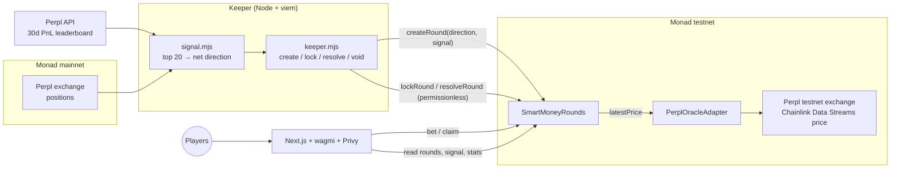
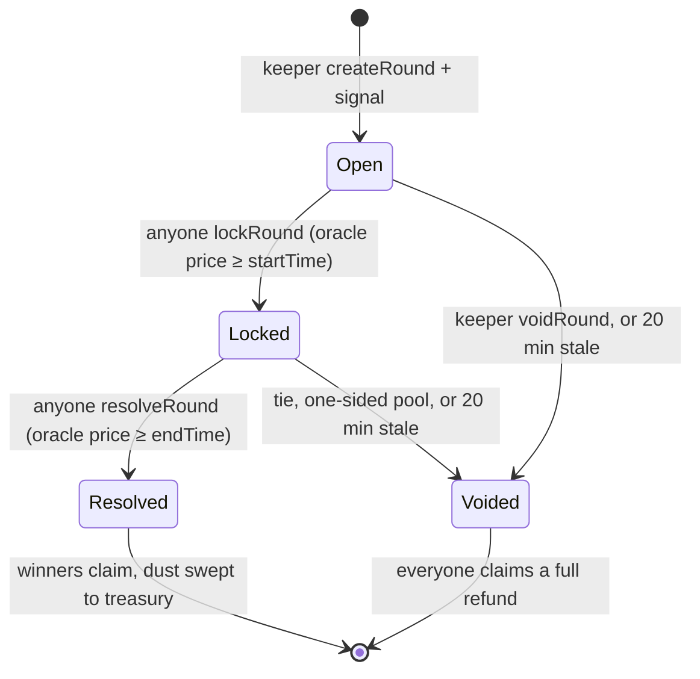

# Tail or Fade

**Perpl's top 20 traders just picked a side. Are they right?**

Every round, Tail or Fade reads the open positions of the 20 most profitable traders on
[Perpl](https://app.perpl.xyz) (Monad's on-chain perps exchange) over the last 30 days and publishes their
net direction on-chain. Players bet that smart money is **right** or **wrong**. The contract reads the start
and end price from Perpl's on-chain oracle itself, anyone can settle a round, and winners split the pool.

Built for **Monad Metropolis, Track 01**.

| | |
| --- | --- |
| **Live app** | **https://smartmoney-zeta.vercel.app** |
| Live contract (Monad testnet) | [`0x860844ca0ca1f3ec43a8045370d7cef8b329f141`](https://testnet.monadvision.com/address/0x860844ca0ca1f3ec43a8045370d7cef8b329f141) |
| Oracle adapter | [`0x762378bcabb0507b56c56fcdd24986b3f6d5c1b3`](https://testnet.monadvision.com/address/0x762378bcabb0507b56c56fcdd24986b3f6d5c1b3) |
| Markets | BTC 1h, BTC 15m, ETH 1h, SOL 1h |
| Tests | 46 Foundry tests: unit, fuzz, 5 handler invariants |

## Why it is interesting

- **Real on-chain signal.** "Smart money" is not a vibe: it is Perpl's 30-day PnL leaderboard plus each
  trader's position read from the Perpl exchange contract at one pinned mainnet block. The full list is
  emitted on-chain with every round and can be re-derived by anyone (`npm run verify-signal <id>`).
- **Trust-minimized settlement.** Prices come from an immutable oracle (Perpl's Chainlink Data Streams
  price, stored on-chain on Monad testnet, updated about every minute). Nobody types in a price. Anyone can
  lock and resolve; if nobody does within 20 minutes, anyone can void and everyone is refunded.
- **Monad-native.** 15-minute rounds, per-round signals of about 1.5 KB emitted as events, and a UI that
  polls live oracle prices every few seconds are cheap and fast on Monad.
- **Full history with Envio.** The public Monad RPC caps `eth_getLogs` at ~100 blocks, so a browser can't see
  past bets or results. The app's `/api/activity` route pulls every contract event since deployment from
  **Envio HyperSync** and powers the live activity feed, protocol totals (bets, volume, players) and the
  round-by-round track record strip. See [Envio integration](#envio-integration).
- **An honest market.** Our 7-day backtest shows smart money is right about half the time over one hour
  (BTC 50.6%, ETH 47%, SOL 51.8%), even with a selection bias in its favour. That is what makes
  "right or wrong?" a genuinely open question.

## Architecture



Round lifecycle:



## Envio integration

| | |
| --- | --- |
| Service | Envio **HyperSync** (`https://monad-testnet.hypersync.xyz`, chain 10143) |
| Code | [`frontend/src/lib/envio.ts`](frontend/src/lib/envio.ts), [`frontend/src/app/api/activity/route.ts`](frontend/src/app/api/activity/route.ts) |
| Data | `RoundCreated`, `BetPlaced`, `RoundLocked`, `RoundResolved`, `RoundVoided`, `Claimed` since the deploy block, paged by `next_block`, decoded with viem |
| Features | Live activity feed, protocol totals, per-market round-by-round history (home page and track record) |
| Caching | Edge-cached 15 s, so all visitors share one HyperSync request |
| Config | `ENVIO_API_TOKEN` (server-side env var, from https://app.envio.dev/api-tokens) |

Without HyperSync these features are impossible from the browser: the Monad testnet RPC answers
`eth_getLogs` only for ~100-block ranges and 15 requests/second.

## Repository

| Folder | What |
| --- | --- |
| [`contracts/`](contracts/) | `SmartMoneyRounds.sol`, `PerplOracleAdapter.sol`, Foundry tests, [threat model](contracts/SECURITY.md) |
| [`keeper/`](keeper/) | Signal builder, keeper loop, deploy, `verify-signal`, backtest |
| [`frontend/`](frontend/) | Next.js 16 app: rounds, live price, signal panel, track record, leaderboard, share cards |
| [`deployments/`](deployments/) | Deployed addresses and config |
| [`docs/DEMO.md`](docs/DEMO.md) | Demo video script |

## Run it

```bash
# contracts
cd contracts && forge test

# keeper (needs contracts/.env with DEPLOYER_PRIVATE_KEY of the keeper wallet)
cd keeper && npm ci
npm run keeper            # loop forever
npm run tick              # one idempotent tick (cron)
npm run verify-signal 1   # re-derive round 1's signal from Perpl mainnet
npm run backtest          # refresh frontend/public/backtest.json

# frontend
cd frontend && npm ci && npm run dev
```

A backup keeper runs every 5 minutes in GitHub Actions ([`.github/workflows/keeper.yml`](.github/workflows/keeper.yml))
once the `KEEPER_PRIVATE_KEY` secret is set.

## Deploy

- **Contracts:** `cd keeper && OWNER=0x... TREASURY=0x... npm run deploy` deploys the adapter and the rounds contract,
  registers the markets, hands ownership to `OWNER` and writes `deployments/monad-testnet.json`.
  (`forge script script/Deploy.s.sol` does the same where forge can reach the RPC.)
- **Frontend (Vercel):** import the repo, set **Root Directory** to `frontend`. No env vars are required; see
  [`frontend/.env.example`](frontend/.env.example) for Privy and overrides.

## Known limits

- The trader list comes from Perpl's leaderboard API, which is off-chain; positions and direction are verifiable,
  the ranking itself is not.
- Anyone settling a round can choose the moment within the 20-minute window, i.e. pick among roughly 20 oracle
  prices. The keeper settles within seconds, which leaves little room, but it is a residual edge.
- Testnet only. MON on testnet has no value.
